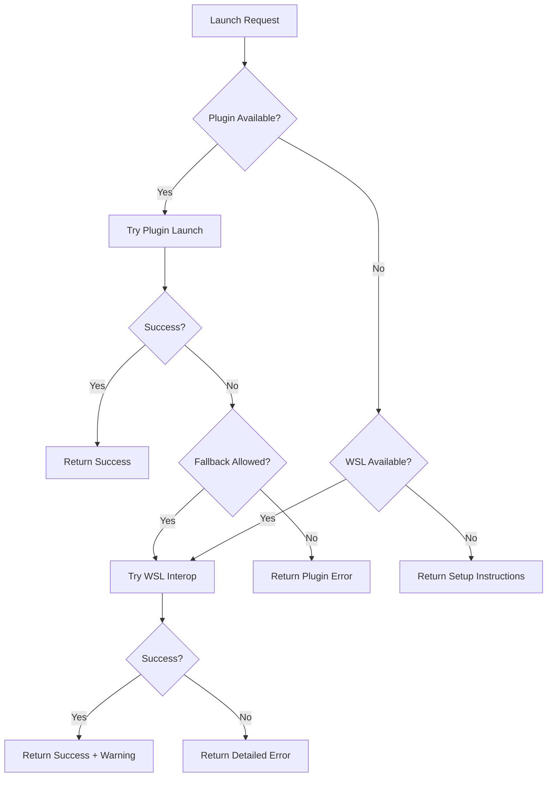

# LaunchBox HTTP Plugin Architecture Contract

**Version:** 1.0.0
**Status:** Authoritative Design Document
**Owner:** Promethea (Layout Architecture)
**Implementation:** Hera (Component Logic)
**Created:** 2025-10-12

---

## Executive Summary

This document defines the architectural contract for a local HTTP plugin that bridges the WSL/Linux environment with native Windows LaunchBox functionality. The plugin solves the critical game launch issue by exposing LaunchBox's native API through a secure, localhost-only HTTP interface.

---

## 1. System Architecture Overview

### 1.1 Component Topology

```
┌─────────────────────────────────────────────────────────────┐
│                     Windows Host (Native)                     │
│                                                               │
│  ┌─────────────────────────────────────────────────────┐    │
│  │        LaunchBox Application (C:\LaunchBox)          │    │
│  │  ┌──────────────────────────────────────────────┐   │    │
│  │  │   LaunchBox HTTP Plugin (.NET/C#)            │   │    │
│  │  │   - HttpListener on 127.0.0.1:31337          │   │    │
│  │  │   - PluginHelper.LaunchBoxMainViewModel      │   │    │
│  │  └──────────────────────────────────────────────┘   │    │
│  └─────────────────────────────────────────────────────┘    │
│                           ▲                                   │
│                           │ HTTP (loopback only)              │
│                           ▼                                   │
│  ┌─────────────────────────────────────────────────────┐    │
│  │              WSL2 Environment (Linux)                │    │
│  │  ┌──────────────────────────────────────────────┐   │    │
│  │  │   Arcade Assistant Backend (FastAPI)         │   │    │
│  │  │   - Plugin health monitoring                 │   │    │
│  │  │   - Launch request routing                   │   │    │
│  │  │   - Fallback chain management               │   │    │
│  │  └──────────────────────────────────────────────┘   │    │
│  └─────────────────────────────────────────────────────┘    │
└─────────────────────────────────────────────────────────────┘
```

### 1.2 Communication Flow

```
Frontend Panel → Gateway (8787) → Backend (8888) → Plugin (31337) → LaunchBox.exe
                                        ↓
                                   Fallback Chain
                                        ↓
                                   WSL Interop
                                        ↓
                                   Error Display
```

---

## 2. API Contract Specification

### 2.1 Base Configuration

```yaml
Plugin Server:
  Host: 127.0.0.1  # Loopback only - no external access
  Port: 31337       # Fixed port for predictable discovery
  Protocol: HTTP    # Not HTTPS - localhost only
  Timeout: 5000ms   # Max request timeout
  Retry: 3          # Health check retry count
```

### 2.2 Endpoint Specifications

#### 2.2.1 Health Check Endpoint

**Request:**
```http
GET /health HTTP/1.1
Host: 127.0.0.1:31337
Accept: application/json
```

**Response - Success (200 OK):**
```json
{
  "available": true,
  "version": "1.0.0",
  "launchbox": {
    "connected": true,
    "version": "13.15",
    "platform_count": 53,
    "game_count": 14233
  },
  "timestamp": "2025-10-12T14:30:00Z"
}
```

**Response - Degraded (200 OK):**
```json
{
  "available": true,
  "version": "1.0.0",
  "launchbox": {
    "connected": false,
    "error": "LaunchBox not running"
  },
  "timestamp": "2025-10-12T14:30:00Z"
}
```

#### 2.2.2 Game Launch Endpoint

**Request:**
```http
POST /launch HTTP/1.1
Host: 127.0.0.1:31337
Content-Type: application/json
Accept: application/json

{
  "game_id": "550e8400-e29b-41d4-a716-446655440000",
  "fallback_allowed": true,
  "launch_options": {
    "fullscreen": true,
    "mute_on_start": false
  }
}
```

**Response - Success (200 OK):**
```json
{
  "launched": true,
  "method": "launchbox_native",
  "game": {
    "id": "550e8400-e29b-41d4-a716-446655440000",
    "title": "Street Fighter II",
    "platform": "Arcade",
    "emulator": "MAME"
  },
  "process": {
    "pid": 12345,
    "started_at": "2025-10-12T14:30:15Z"
  }
}
```

**Response - Game Not Found (404):**
```json
{
  "launched": false,
  "error": "game_not_found",
  "message": "No game found with ID: 550e8400-e29b-41d4-a716-446655440000",
  "suggestion": "Verify game ID from /api/launchbox/games endpoint"
}
```

**Response - Launch Failed (500):**
```json
{
  "launched": false,
  "error": "launch_failed",
  "message": "Failed to start game process",
  "details": {
    "emulator_missing": false,
    "rom_missing": true,
    "rom_path": "A:\\Roms\\MAME\\sf2.zip"
  }
}
```

---

## 3. Error Handling Strategy

### 3.1 Error Classification

```typescript
enum LaunchErrorType {
  PLUGIN_OFFLINE = "plugin_offline",
  PLUGIN_TIMEOUT = "plugin_timeout",
  GAME_NOT_FOUND = "game_not_found",
  ROM_MISSING = "rom_missing",
  EMULATOR_MISSING = "emulator_missing",
  LAUNCH_FAILED = "launch_failed",
  PERMISSION_DENIED = "permission_denied"
}
```

### 3.2 Backend Error Handler

```python
class PluginErrorHandler:
    """Centralized error handling for plugin communication"""

    ERROR_MESSAGES = {
        "plugin_offline": "LaunchBox plugin not responding. Please ensure LaunchBox is running.",
        "plugin_timeout": "Request to LaunchBox timed out. The application may be busy.",
        "game_not_found": "Game not found in LaunchBox database.",
        "rom_missing": "ROM file not found at expected location.",
        "emulator_missing": "Required emulator not configured in LaunchBox.",
        "launch_failed": "Failed to launch game. Check LaunchBox logs.",
        "permission_denied": "Access denied. Run LaunchBox as administrator."
    }

    @staticmethod
    def format_user_message(error_type: str, details: dict = None) -> str:
        base_message = PluginErrorHandler.ERROR_MESSAGES.get(
            error_type,
            "Unknown error occurred"
        )

        if details:
            detail_text = "\n".join([f"• {k}: {v}" for k, v in details.items()])
            return f"{base_message}\n\nDetails:\n{detail_text}"

        return base_message
```

---

## 4. Fallback Flow Architecture

### 4.1 Launch Chain Priority



### 4.2 Backend Implementation Pattern

```python
class LaunchManager:
    """Manages game launch with fallback chain"""

    def __init__(self):
        self.plugin_client = PluginHTTPClient()
        self.wsl_launcher = WSLInteropLauncher()

    async def launch_game(self, game_id: str, options: dict) -> LaunchResult:
        """Execute launch chain with fallback logic"""

        # Step 1: Check plugin availability
        if await self.plugin_client.is_healthy():
            try:
                result = await self.plugin_client.launch(game_id, options)
                if result.launched:
                    return result
            except PluginError as e:
                logger.warning(f"Plugin launch failed: {e}")
                if not options.get("fallback_allowed", True):
                    raise

        # Step 2: Fallback to WSL interop
        if self.wsl_launcher.is_available():
            result = await self.wsl_launcher.launch(game_id, options)
            result.add_warning("Launched via WSL interop - some features may be limited")
            return result

        # Step 3: No launch method available
        raise LaunchError(
            "No launch method available",
            suggestions=[
                "Ensure LaunchBox is running on Windows host",
                "Enable WSL interop in Windows Features",
                "Check plugin installation at LaunchBox/Plugins/HTTPBridge"
            ]
        )
```

---

## 5. Security Constraints

### 5.1 Network Security

```yaml
Security Rules:
  - Binding: 127.0.0.1 ONLY (no 0.0.0.0)
  - External Access: FORBIDDEN
  - Firewall: Block port 31337 external
  - CORS: Not applicable (same origin)
  - Authentication: None (localhost trust)
  - Encryption: None (loopback interface)
```

### 5.2 Input Validation

```csharp
public class RequestValidator
{
    // Plugin-side validation
    public static bool ValidateGameId(string gameId)
    {
        // UUID format validation
        return Guid.TryParse(gameId, out _);
    }

    public static bool ValidateLaunchOptions(Dictionary<string, object> options)
    {
        var allowedKeys = new[] { "fullscreen", "mute_on_start", "controller_profile" };
        return options.Keys.All(k => allowedKeys.Contains(k));
    }
}
```

### 5.3 Process Isolation

```yaml
Process Boundaries:
  - Plugin runs in LaunchBox process space
  - No elevation required (user context)
  - No file system access outside LaunchBox paths
  - No network access except localhost HTTP
  - No registry modifications
```

---

## 6. Frontend Integration Points

### 6.1 Health Check Integration

```typescript
// Frontend health check before launch
class LaunchBoxService {
  private pluginHealthCache: HealthStatus | null = null;
  private cacheExpiry: number = 0;

  async checkPluginHealth(): Promise<HealthStatus> {
    // Cache for 30 seconds to reduce overhead
    if (this.pluginHealthCache && Date.now() < this.cacheExpiry) {
      return this.pluginHealthCache;
    }

    try {
      const response = await fetch('/api/launchbox/plugin/health');
      const data = await response.json();

      this.pluginHealthCache = data;
      this.cacheExpiry = Date.now() + 30000; // 30 second cache

      return data;
    } catch (error) {
      return { available: false, error: 'Plugin unreachable' };
    }
  }

  async launchGame(gameId: string): Promise<LaunchResult> {
    // Block launch if plugin unavailable
    const health = await this.checkPluginHealth();

    if (!health.available) {
      throw new LaunchError(
        'LaunchBox plugin offline',
        'Please ensure LaunchBox is running with the HTTP plugin installed'
      );
    }

    return fetch('/api/launchbox/launch', {
      method: 'POST',
      headers: { 'Content-Type': 'application/json' },
      body: JSON.stringify({ game_id: gameId })
    });
  }
}
```

### 6.2 UI State Management

```typescript
// Panel state for launch readiness
interface LaunchState {
  pluginStatus: 'checking' | 'online' | 'offline' | 'degraded';
  canLaunch: boolean;
  statusMessage: string;
  lastCheck: Date;
}

// Visual indicators in panel
const LaunchStatusIndicator: React.FC<{status: LaunchState}> = ({status}) => {
  const indicatorClass = {
    'checking': 'bg-yellow-500 animate-pulse',
    'online': 'bg-green-500',
    'offline': 'bg-red-500',
    'degraded': 'bg-orange-500'
  }[status.pluginStatus];

  return (
    <div className="flex items-center gap-2">
      <div className={`w-2 h-2 rounded-full ${indicatorClass}`} />
      <span className="text-sm">{status.statusMessage}</span>
    </div>
  );
};
```

---

## 7. Backend Integration Points

### 7.1 Plugin Client Implementation

```python
# backend/services/launchbox_plugin.py

import aiohttp
import asyncio
from typing import Optional, Dict, Any
from dataclasses import dataclass

@dataclass
class PluginConfig:
    """Plugin connection configuration"""
    host: str = "127.0.0.1"
    port: int = 31337
    timeout: float = 5.0
    retry_count: int = 3
    retry_delay: float = 1.0

class LaunchBoxPluginClient:
    """HTTP client for LaunchBox plugin communication"""

    def __init__(self, config: PluginConfig = None):
        self.config = config or PluginConfig()
        self.base_url = f"http://{self.config.host}:{self.config.port}"
        self.session: Optional[aiohttp.ClientSession] = None

    async def __aenter__(self):
        self.session = aiohttp.ClientSession(
            timeout=aiohttp.ClientTimeout(total=self.config.timeout)
        )
        return self

    async def __aexit__(self, *args):
        if self.session:
            await self.session.close()

    async def health_check(self) -> Dict[str, Any]:
        """Check plugin health with retries"""
        last_error = None

        for attempt in range(self.config.retry_count):
            try:
                async with self.session.get(f"{self.base_url}/health") as response:
                    if response.status == 200:
                        return await response.json()
            except Exception as e:
                last_error = e
                if attempt < self.config.retry_count - 1:
                    await asyncio.sleep(self.config.retry_delay)

        return {
            "available": False,
            "error": str(last_error),
            "retry_attempts": self.config.retry_count
        }

    async def launch_game(self, game_id: str, options: Dict = None) -> Dict[str, Any]:
        """Launch game via plugin"""
        payload = {
            "game_id": game_id,
            "fallback_allowed": True,
            "launch_options": options or {}
        }

        try:
            async with self.session.post(
                f"{self.base_url}/launch",
                json=payload
            ) as response:
                return await response.json()
        except aiohttp.ClientError as e:
            return {
                "launched": False,
                "error": "plugin_communication_failed",
                "message": str(e)
            }
```

### 7.2 Router Integration

```python
# backend/routers/launchbox.py (additions)

from services.launchbox_plugin import LaunchBoxPluginClient, PluginConfig

@router.get("/plugin/health")
async def check_plugin_health():
    """Check LaunchBox HTTP plugin status"""
    async with LaunchBoxPluginClient() as client:
        return await client.health_check()

@router.post("/launch/{game_id}")
async def launch_game(
    game_id: str,
    options: Dict = Body(default={}),
    fallback: bool = Query(default=True)
):
    """Launch game with plugin preference and fallback chain"""

    # Try plugin first
    async with LaunchBoxPluginClient() as client:
        health = await client.health_check()

        if health.get("available"):
            result = await client.launch_game(game_id, options)
            if result.get("launched"):
                return result

    # Fallback logic
    if fallback:
        # Attempt WSL interop launch
        return await launch_via_wsl_interop(game_id, options)

    # No fallback - return error
    raise HTTPException(
        status_code=503,
        detail="LaunchBox plugin unavailable and fallback disabled"
    )
```

---

## 8. Plugin Implementation Guide

### 8.1 C# Plugin Structure

```csharp
// LaunchBox.Plugins.HTTPBridge.cs

using System;
using System.Net;
using System.Threading;
using System.Threading.Tasks;
using Unbroken.LaunchBox.Plugins;
using Newtonsoft.Json;

namespace LaunchBox.Plugins
{
    public class HTTPBridge : ISystemEventsPlugin
    {
        private HttpListener listener;
        private Thread serverThread;
        private bool running = false;

        public void OnEventRaised(string eventType)
        {
            if (eventType == SystemEventTypes.LaunchBoxStartupCompleted)
            {
                StartHTTPServer();
            }
            else if (eventType == SystemEventTypes.LaunchBoxShutdownBeginning)
            {
                StopHTTPServer();
            }
        }

        private void StartHTTPServer()
        {
            listener = new HttpListener();
            listener.Prefixes.Add("http://127.0.0.1:31337/");
            listener.Start();

            running = true;
            serverThread = new Thread(ServerLoop);
            serverThread.Start();
        }

        private void ServerLoop()
        {
            while (running)
            {
                try
                {
                    var context = listener.GetContext();
                    Task.Run(() => HandleRequest(context));
                }
                catch (HttpListenerException)
                {
                    // Listener stopped
                    break;
                }
            }
        }

        private async Task HandleRequest(HttpListenerContext context)
        {
            var request = context.Request;
            var response = context.Response;

            // Set CORS headers for localhost
            response.Headers.Add("Access-Control-Allow-Origin", "http://localhost:8787");

            try
            {
                if (request.HttpMethod == "GET" && request.Url.AbsolutePath == "/health")
                {
                    await HandleHealthCheck(response);
                }
                else if (request.HttpMethod == "POST" && request.Url.AbsolutePath == "/launch")
                {
                    await HandleLaunchGame(request, response);
                }
                else
                {
                    response.StatusCode = 404;
                }
            }
            catch (Exception ex)
            {
                response.StatusCode = 500;
                await WriteJsonResponse(response, new { error = ex.Message });
            }
            finally
            {
                response.Close();
            }
        }

        private async Task HandleHealthCheck(HttpListenerResponse response)
        {
            var health = new
            {
                available = true,
                version = "1.0.0",
                launchbox = new
                {
                    connected = PluginHelper.LaunchBoxMainViewModel != null,
                    version = PluginHelper.LaunchBoxMainViewModel?.VersionString,
                    platform_count = PluginHelper.DataManager.GetAllPlatforms().Count,
                    game_count = PluginHelper.DataManager.GetAllGames().Count
                },
                timestamp = DateTime.UtcNow
            };

            await WriteJsonResponse(response, health);
        }

        private async Task HandleLaunchGame(HttpListenerRequest request, HttpListenerResponse response)
        {
            // Parse request body
            var body = await ReadRequestBody(request);
            var launchRequest = JsonConvert.DeserializeObject<LaunchRequest>(body);

            // Find game
            var game = PluginHelper.DataManager.GetGameById(launchRequest.GameId);
            if (game == null)
            {
                response.StatusCode = 404;
                await WriteJsonResponse(response, new
                {
                    launched = false,
                    error = "game_not_found",
                    message = $"No game found with ID: {launchRequest.GameId}"
                });
                return;
            }

            // Launch game
            try
            {
                PluginHelper.LaunchBoxMainViewModel.LaunchGame(game);

                await WriteJsonResponse(response, new
                {
                    launched = true,
                    method = "launchbox_native",
                    game = new
                    {
                        id = game.Id,
                        title = game.Title,
                        platform = game.Platform,
                        emulator = game.EmulatorTitle
                    },
                    process = new
                    {
                        started_at = DateTime.UtcNow
                    }
                });
            }
            catch (Exception ex)
            {
                response.StatusCode = 500;
                await WriteJsonResponse(response, new
                {
                    launched = false,
                    error = "launch_failed",
                    message = ex.Message
                });
            }
        }
    }
}
```

---

## 9. Testing Strategy

### 9.1 Integration Test Suite

```python
# tests/test_plugin_integration.py

import pytest
import asyncio
from unittest.mock import patch, AsyncMock

@pytest.mark.asyncio
async def test_plugin_health_check():
    """Test plugin health check with retry logic"""
    with patch('aiohttp.ClientSession.get') as mock_get:
        mock_get.return_value.__aenter__.return_value.status = 200
        mock_get.return_value.__aenter__.return_value.json = AsyncMock(
            return_value={"available": True, "version": "1.0.0"}
        )

        client = LaunchBoxPluginClient()
        result = await client.health_check()

        assert result["available"] is True
        assert result["version"] == "1.0.0"

@pytest.mark.asyncio
async def test_fallback_chain():
    """Test launch fallback from plugin to WSL"""
    manager = LaunchManager()

    # Mock plugin as unavailable
    manager.plugin_client.is_healthy = AsyncMock(return_value=False)

    # Mock WSL as available
    manager.wsl_launcher.is_available = Mock(return_value=True)
    manager.wsl_launcher.launch = AsyncMock(
        return_value=LaunchResult(launched=True, method="wsl_interop")
    )

    result = await manager.launch_game("test-id", {"fallback_allowed": True})

    assert result.launched is True
    assert result.method == "wsl_interop"
    assert "WSL interop" in result.warnings[0]
```

### 9.2 Manual Test Checklist

```markdown
## Plugin Integration Test Checklist

### Pre-Launch Tests
- [ ] LaunchBox running on Windows host
- [ ] Plugin DLL in LaunchBox/Plugins folder
- [ ] Plugin appears in LaunchBox plugin manager
- [ ] No firewall blocking port 31337

### Health Check Tests
- [ ] GET http://127.0.0.1:31337/health returns 200
- [ ] Response includes version and game count
- [ ] Response time under 100ms
- [ ] Retry logic works when LaunchBox starting

### Launch Tests
- [ ] Valid game ID launches successfully
- [ ] Invalid game ID returns 404
- [ ] Missing ROM returns appropriate error
- [ ] Process tracking works correctly

### Fallback Tests
- [ ] WSL fallback triggers when plugin offline
- [ ] Fallback disabled when flag set to false
- [ ] Error messages guide user to solution
- [ ] Frontend blocks launch when no method available

### Security Tests
- [ ] Port 31337 not accessible externally
- [ ] No response on 0.0.0.0 binding
- [ ] Input validation prevents injection
- [ ] No elevation required for normal operation
```

---

## 10. Monitoring & Diagnostics

### 10.1 Logging Strategy

```python
# Structured logging for plugin operations

import structlog

logger = structlog.get_logger()

class PluginMonitor:
    """Monitor plugin health and performance"""

    def __init__(self):
        self.metrics = {
            "health_checks": 0,
            "successful_launches": 0,
            "failed_launches": 0,
            "fallback_count": 0,
            "average_response_time": 0
        }

    async def log_launch_attempt(self, game_id: str, method: str, success: bool, duration: float):
        """Log launch attempt with structured data"""

        logger.info(
            "game_launch_attempt",
            game_id=game_id,
            method=method,
            success=success,
            duration_ms=duration * 1000,
            fallback_used=method != "plugin",
            timestamp=datetime.utcnow().isoformat()
        )

        # Update metrics
        if success:
            self.metrics["successful_launches"] += 1
        else:
            self.metrics["failed_launches"] += 1

        if method != "plugin":
            self.metrics["fallback_count"] += 1
```

### 10.2 Health Dashboard Integration

```typescript
// Frontend health monitoring component

interface PluginHealth {
  status: 'online' | 'offline' | 'degraded';
  lastCheck: Date;
  metrics: {
    uptime: number;
    launches_today: number;
    success_rate: number;
    avg_response_ms: number;
  };
}

const PluginHealthWidget: React.FC = () => {
  const [health, setHealth] = useState<PluginHealth | null>(null);

  useEffect(() => {
    // Poll health every 30 seconds
    const interval = setInterval(async () => {
      const response = await fetch('/api/launchbox/plugin/metrics');
      const data = await response.json();
      setHealth(data);
    }, 30000);

    return () => clearInterval(interval);
  }, []);

  return (
    <div className="bg-gray-800 rounded-lg p-4">
      <h3 className="text-sm font-semibold mb-2">LaunchBox Plugin</h3>
      <div className="grid grid-cols-2 gap-2 text-xs">
        <div>Status: {health?.status || 'checking...'}</div>
        <div>Uptime: {health?.metrics.uptime || 0}h</div>
        <div>Success Rate: {health?.metrics.success_rate || 0}%</div>
        <div>Avg Response: {health?.metrics.avg_response_ms || 0}ms</div>
      </div>
    </div>
  );
};
```

---

## 11. Deployment & Installation

### 11.1 Plugin Installation Steps

```markdown
## LaunchBox HTTP Plugin Installation

1. **Download Plugin**
   - Get HTTPBridge.dll from releases
   - Verify checksum: SHA256 provided in release notes

2. **Install to LaunchBox**
   - Copy HTTPBridge.dll to: C:\LaunchBox\Plugins\
   - Create folder if not exists: C:\LaunchBox\Plugins\HTTPBridge\

3. **Configure Windows Firewall**
   - No external rule needed (localhost only)
   - Ensure no blocking rule for port 31337

4. **Verify Installation**
   - Restart LaunchBox
   - Check Tools → Manage Plugins → HTTPBridge listed
   - Test: curl http://127.0.0.1:31337/health

5. **Troubleshooting**
   - Check LaunchBox logs: Data\Logs\
   - Verify .NET Framework 4.8+ installed
   - Run LaunchBox as admin if permission errors
```

### 11.2 Backend Configuration

```python
# .env configuration for plugin support

# LaunchBox Plugin Settings
LAUNCHBOX_PLUGIN_ENABLED=true
LAUNCHBOX_PLUGIN_HOST=127.0.0.1
LAUNCHBOX_PLUGIN_PORT=31337
LAUNCHBOX_PLUGIN_TIMEOUT=5.0
LAUNCHBOX_PLUGIN_RETRY_COUNT=3

# Fallback Settings
LAUNCHBOX_FALLBACK_TO_WSL=true
LAUNCHBOX_WSL_INTEROP_PATH=/mnt/c/LaunchBox/LaunchBox.exe
```

---

## 12. Future Enhancements

### 12.1 Planned Features

```yaml
Version 1.1:
  - WebSocket support for real-time game status
  - Batch launch for tournament mode
  - Screenshot capture on launch
  - Performance metrics collection

Version 1.2:
  - Remote control via secure tunnel
  - Cloud save sync integration
  - Multi-instance support
  - Plugin auto-update mechanism

Version 2.0:
  - GraphQL API instead of REST
  - Plugin SDK for extensions
  - Advanced filtering in launch requests
  - Integration with streaming platforms
```

---

## Appendix A: Error Code Reference

| Code | Type | Message | User Action |
|------|------|---------|-------------|
| E001 | plugin_offline | Plugin not responding | Start LaunchBox |
| E002 | plugin_timeout | Request timeout | Retry or check LaunchBox |
| E003 | game_not_found | Game ID invalid | Verify game exists |
| E004 | rom_missing | ROM file not found | Check ROM location |
| E005 | emulator_missing | Emulator not configured | Configure in LaunchBox |
| E006 | launch_failed | Process start failed | Check logs |
| E007 | permission_denied | Access denied | Run as administrator |
| E008 | port_blocked | Port 31337 in use | Close conflicting app |
| E009 | version_mismatch | Plugin version incompatible | Update plugin |
| E010 | wsl_unavailable | WSL interop failed | Enable WSL features |

---

## Appendix B: Performance Benchmarks

| Operation | Target | Acceptable | Degraded |
|-----------|--------|------------|----------|
| Health Check | <50ms | <100ms | >100ms |
| Game Launch | <500ms | <1000ms | >1000ms |
| Retry Cycle | <3s | <5s | >5s |
| Plugin Startup | <2s | <5s | >5s |
| Memory Usage | <50MB | <100MB | >100MB |

---

## Document Control

- **Version:** 1.0.0
- **Status:** Ready for Implementation
- **Next Review:** After initial implementation
- **Implementation Owner:** Hera (Component Logic)
- **Architecture Owner:** Promethea (Layout Structure)

This contract represents the complete architectural specification. Any deviations require formal review and version increment.