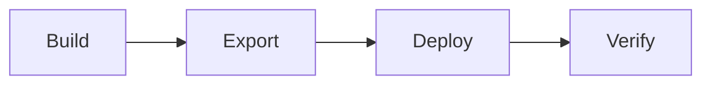

# 🕹️ Arcade Assistant: Field Tech Quick Start Card

> **One-page guide** for deploying the 15,000+ game Golden Drive.

## 🔄 The Deployment Lifecycle



| Step | Tool | What Happens |
|---|---|---|
| **Build** | Playnite Auto-scan | Discover 15,000 ROMs on master cabinet |
| **Export** | `Backup-Creator.ps1` | Snapshot library + metadata + manifest |
| **Deploy** | `run_all_remediation.bat` | Copy, re-link paths, verify 38 ROM dirs |
| **Verify** | `Launch-Sanity-Check.ps1` | Confirm 100% ROM reachability |

## ⌨️ The Two Essential Commands

**Create a backup** (on master cabinet):
```powershell
.\Backup-Creator.ps1 -DestinationPath "E:\Backups"
```

**Deploy to a new cabinet:**
1. Connect backup drive
2. Double-click `run_all_remediation.bat`
3. Enter Backup Path and Original Drive Letter when prompted

## 🛠️ Troubleshooting

| Issue | Cause | Fix |
|---|---|---|
| "Database is Locked" | Playnite still running | Close Playnite completely |
| 38 Dirs Missing | Drive A: not mounted | Verify `A:\Roms\` and `A:\Console ROMs\` exist |
| Broken Paths in Report | Wrong drive letter entered | Re-run batch with correct letter |
| Missing Covers/Icons | Metadata copy failed | Check `A:\Playnite\Metadata\` is populated |

> ⚠️ All scripts expect Portable Playnite at `A:\Playnite`. Different drive letter? Run `Fix-ArcadePaths.ps1` to retarget.
